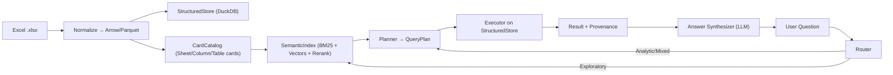
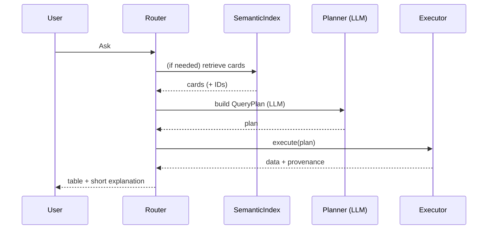

# LLM × Excel Structured Data Pipeline

## Overview
This project enables robust, LLM-driven question-answering and analytics over structured Excel data. It leverages:
- **LlamaParse** for robust Excel (and other document) ingestion
- **DSPy** for LLM orchestration (Anthropic Claude, OpenAI GPT-4)
- **DuckDB** for fast, SQL-like analytics
- **Semantic search** (BM25 + vectors) for card-based discovery

The pipeline is modular, extensible, and designed for both deterministic analytics and semantic exploration.

---

## Directory Structure
```
excel_parse/
│
├── README.md                # This documentation
├── requirements.txt         # Python dependencies
├── .env.example             # Environment variable template
│
├── data/
│   ├── sample.xlsx          # Sample Excel file
│   ├── sample.parquet       # Normalized Parquet file
│   └── cards.json           # Card catalog (Sheet/Table/Column cards)
│
├── src/
│   ├── ingest.py            # Ingest & normalize Excel (LlamaParse integration)
│   ├── profiling.py         # Profile tables (dtypes, nulls, etc.)
│   ├── cards.py             # Cardize: generate Sheet/Table/Column cards
│   ├── store.py             # StructuredStore: DuckDB interface
│   ├── semantic_index.py    # BM25 + vector index for cards
│   ├── router.py            # Query router (classifies query type)
│   ├── planner.py           # LLM-driven QueryPlan builder (DSPy/Anthropic)
│   ├── executor.py          # Executes QueryPlan on StructuredStore
│   └── agent.py             # Orchestrates the full pipeline
│
└── tests/
    └── test_pipeline.py    # End-to-end pipeline test
```

---

## Data Flow & Architecture

### Step-by-Step Pipeline
1. **Ingest & Normalize**
   - Excel file is parsed via LlamaParse API (if configured) or pandas.
   - Data is normalized, types coerced, and saved as Parquet.
2. **Profile**
   - Compute dtypes, nulls, min/max, n_unique, tag order columns.
3. **Cardize**
   - Generate SheetCard, TableCard, ColumnCard objects (with IDs, text, and examples).
4. **Semantic Index**
   - Cards are indexed with BM25 (TF-IDF) and sentence-transformers for semantic search.
5. **Router**
   - Classifies user query as ANALYTIC, EXPLORATORY, or MIXED.
6. **Planner (LLM-driven)**
   - DSPy/Anthropic LLM receives a strict prompt (schema, cards, examples) and outputs a valid JSON QueryPlan.
7. **Executor**
   - Runs the QueryPlan on DuckDB, returns data and provenance.
8. **Synthesis**
   - LLM (Claude or OpenAI) generates a natural language answer using the table, provenance, and card explanations.

### Mermaid Architecture Diagram


### Sequence Diagram


---

## LLM-Driven Planning & Execution
- **Planner**: Uses DSPy to call Anthropic Claude (or OpenAI GPT-4) with a strict prompt, schema, and examples.
- **LLM Output**: Must be a valid JSON QueryPlan (robust extraction logic handles explanations and formatting).
- **Executor**: Runs the plan on DuckDB, ensuring provenance and guardrails.
- **Synthesis**: LLM generates a natural language answer, grounded in the data and cards.

---

## How LlamaParse, DSPy, and Anthropic Are Used
- **LlamaParse**: Robustly parses Excel (and other formats) via API, handling complex layouts and normalization.
- **DSPy**: Orchestrates LLM calls for planning and answer synthesis, with fallback to OpenAI if Anthropic is unavailable.
- **Anthropic (Claude)**: Handles both query planning (turning user questions into QueryPlans) and answer synthesis (explaining results).

---

## Example Usage
```bash
# Ingest and normalize Excel
python src/ingest.py

# Generate cards
python src/cards.py > data/cards.json

# Run the full agent pipeline
python src/agent.py "Show last 10 rows of Transactions and explain amount."
python src/agent.py "I want latest transaction show me only 1"
```

---

## Environment Setup
1. Install dependencies:
   ```bash
   pip install -r requirements.txt
   pip install dspy-ai langchain anthropic
   ```
2. Set up your `.env`:
   ```
   LLAMAPARSE_API_KEY=your_llamaparse_api_key
   ANTHROPIC_API_KEY=your_anthropic_api_key
   OPENAI_API_KEY=your_openai_api_key  # (optional)
   ```
3. Place your Excel files in `data/`.

---

## Extensibility
- Add more ingestion adapters (PDF, CSV, Google Sheets) via LlamaParse or custom logic.
- Extend cardization for richer metadata (units, examples, relationships).
- Add more advanced planning modules (multi-table, joins, aggregation).
- Swap out LLMs or add more fallback providers.
- Integrate with web UIs, APIs, or chatbots.

---

## Troubleshooting
- **LLM errors**: Ensure your API keys are set and valid. Check for correct package versions (`dspy-ai`, `langchain`, `anthropic`).
- **LlamaParse errors**: Check your API key and file format. Fallback to pandas if needed.
- **JSON extraction**: The planner robustly extracts JSON from LLM output, but you can further tune prompts for stricter output.
- **DuckDB errors**: Ensure your Parquet files are valid and match the expected schema.

